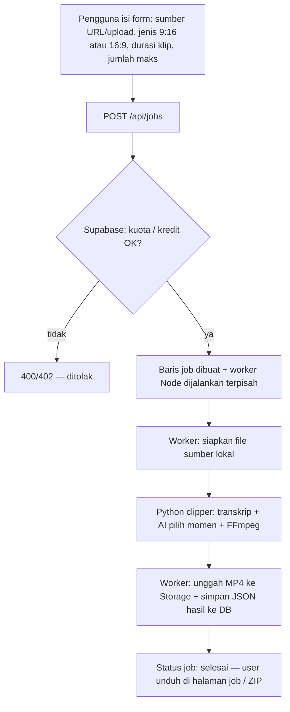
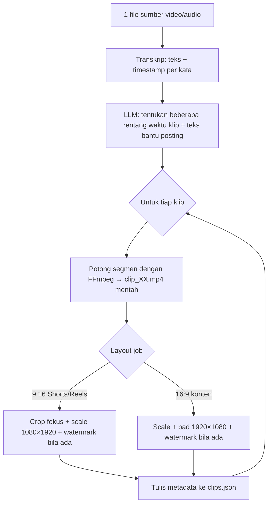
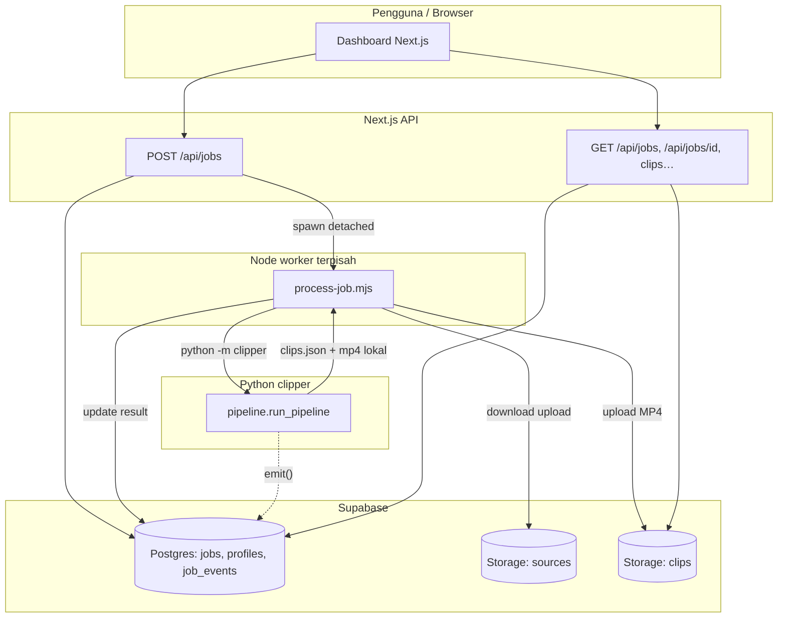
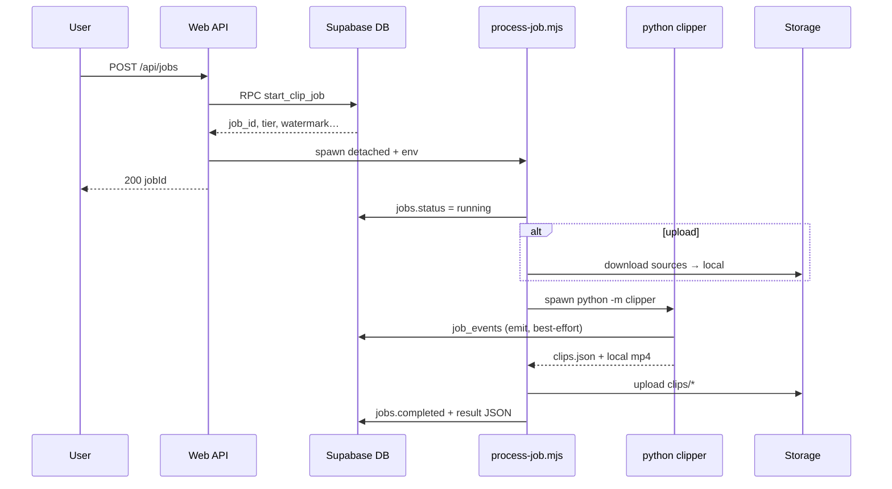
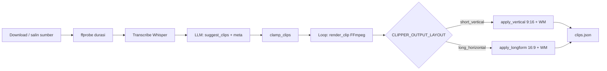

# Alur lengkap Fai-Clipper (AI Video Clipper)

Dokumen ini menjelaskan arsitektur, alur data, dan fase pemrosesan dari sisi **dashboard web**, **worker Node**, **pipeline Python**, hingga **Supabase**. Diagram memakai [Mermaid](https://mermaid.js.org/) (preview di VS Code / GitHub).

---

## 1. Ringkasan sistem


| Lapisan | Peran |
|--------|--------|
| **Next.js (`web/`)** | UI dashboard, autentikasi Supabase, API route membuat job & spawn worker, streaming unduhan klip dari Storage. |
| **`web/scripts/process-job.mjs`** | Proses background: unduh sumber (bila upload), panggil `python -m clipper`, unggah MP4 + tulis `result` ke tabel `jobs`. |
| **`clipper/` (Python)** | Unduh/ambil file, transkrip, analisis LLM, potong klip FFmpeg, render 9:16 atau 16:9, tulis `clips.json` + log lokal. |
| **Supabase** | Postgres (`jobs`, `job_events`, `profiles`, RPC `start_clip_job`, dll.), Storage (`sources`, `clips`), Auth. |

### Alur pembuatan video — penjelasan singkat

**Intinya:** satu video sumber (YouTube atau upload) → sistem membuat **beberapa file MP4** (tiap file = satu “klip” pilihan AI), plus **teks** (judul ringkas, caption posting, hashtag) yang hanya tampil di dashboard, bukan tertulis di dalam video.

#### A) Dari klik “Buat klip” sampai file bisa diunduh



- **Sumber URL:** worker tidak menyimpan YouTube permanen di Storage untuk unduhan ulang; Python memakai yt-dlp ke folder job lokal.
- **Sumber upload:** file sudah di bucket `sources`; worker mengunduh ke disk lalu proses sama seperti file lokal.

#### B) Di dalam Python: dari satu sumber ke banyak MP4



| Langkah | Output yang dihasilkan |
|--------|-------------------------|
| Transkrip | Pemahaman isi bicara untuk AI (bukan subtitle di video). |
| LLM | Daftar `(mulai_detik, selesai_detik)` per klip + label + caption + hashtag. |
| Potong | MP4 segmen aspek rasio mengikuti sumber (biasanya horizontal). |
| Render akhir | MP4 final sesuai pilihan user: **vertikal 9:16** atau **horizontal 16:9**. |
| `clips.json` | Ringkasan semua klip + path/flag untuk dashboard. |

---

## 2. Struktur folder (yang paling sering disentuh)

```
AI-Video-Clipper/
├── clipper/                 # Paket Python pipeline
│   ├── __main__.py          # CLI: URL atau --input, -o, --job-id
│   ├── pipeline.py        # Orkestrasi fase utama
│   ├── config.py          # Settings dari env (tier, layout, watermark, …)
│   ├── download.py        # yt-dlp untuk URL YouTube
│   ├── transcribe.py      # Whisper (Groq / lokal)
│   ├── analyze.py         # LLM: saran window klip + caption/hashtag
│   ├── cut.py             # FFmpeg potong segmen
│   ├── phase3_render.py   # 9:16 vertikal atau 16:9 + watermark
│   └── events.py          # POST progress ke job_events (opsional)
├── web/                     # Next.js App Router
│   ├── app/api/jobs/      # POST/GET job, env worker
│   ├── app/dashboard/     # Form job baru, detail job
│   ├── scripts/process-job.mjs
│   └── lib/               # Supabase client, tiers, types
├── docs/
│   └── PROJECT_FLOW.md    # File ini
├── .env.example             # Contoh env pipeline (root)
└── output/<job-id>/        # Lokal: worker + clipper (clips + clips.json)
```

---

## 3. Diagram arsitektur tingkat tinggi




---

## 4. Alur membuat job (dashboard → selesai)

### 4.1 Urutan langkah

1. User login → cookie/session Supabase.
2. **Form job baru** mengirim JSON ke `POST /api/jobs` (URL YouTube atau path upload + opsi durasi, `maxClips`, `outputLayout`, dll.).
3. API memanggil RPC **`start_clip_job`** (kredit/kuota, insert baris `jobs`, batas job aktif).
4. API menyusun **env** untuk child: `SOURCE_URL` atau `SOURCE_STORAGE_PATH`, `USER_TIER`, `CLIPPER_OUTPUT_LAYOUT`, watermark tier berbayar, `CLIP_MIN/MAX_DURATION`, `MAX_CLIPS`, dll.
5. **`spawn(process.execPath, [process-job.mjs, jobId], { detached: true })`** — worker tidak mengikat request HTTP.
6. **process-job.mjs**: set `jobs.status = running`, optional unduh `sources` → file `source.*` lokal.
7. **`python -m clipper`** dengan `cwd` = repo root, `CLIPPER_OUTPUT` = folder output, `--job-id` = UUID job.
8. Setelah exit 0: baca `output/<jobId>/clips.json`, unggah tiap `clip_XX.mp4` ke bucket **`clips`**, patch `jobs` (`status=completed`, `result`, `clips_storage_prefix`, …).
9. Gagal: `status=failed`, `error_message`, RPC **`refund_failed_job`** bila ada.

### 4.2 Diagram urutan (ringkas)




---

## 5. Alur pipeline Python (`run_pipeline`)

Semua fase utama ada di `clipper/pipeline.py`. Progress UI memakai `emit(settings, phase=..., progress=...)` → tabel **`job_events`** (jika `JOB_EVENTS_URL` + token + `CLIPPER_JOB_ID` + `CLIPPER_USER_ID` terisi).




| Fase         | Modul / fungsi                     | Keterangan                                                                                                           |
| ------------ | ---------------------------------- | -------------------------------------------------------------------------------------------------------------------- |
| Sumber       | `download.py` atau salin `--input` | YouTube via yt-dlp; upload sudah jadi file lokal oleh worker.                                                        |
| Durasi       | `media.ffprobe_duration_seconds`   | Cek batas `MAX_SOURCE_DURATION_SEC` per tier.                                                                        |
| Transkrip    | `transcribe.py`                    | Segmen + kata (untuk analisis; subtitle tidak dibakar ke video).                                                     |
| Analisis     | `analyze.suggest_clips`            | Router LLM (`clipper/llm/`) memilih jendela klip + label, caption posting, hashtag.                                  |
| Potong       | `cut.render_clip`                  | FFmpeg `-ss/-t` ke `clips/clip_XX.mp4` (codec H.264 + AAC).                                                          |
| Render akhir | `phase3_render`                    | **9:16**: crop wajah + scale; **16:9**: scale+pad 1920×1080. Watermark drawtext jika `watermark_text` di `Settings`. |
| Metadata     | `clips.json`                       | Diserialisasi ke `job_dir/clips.json` untuk worker Node + kolom `jobs.result`.                                       |


---

## 6. Keputusan produk (watermark & layout)

- `**CLIPPER_OUTPUT_LAYOUT`**: `short_vertical` (1080×1920) atau `long_horizontal` (1920×1080). Di dashboard diisi dari form → env worker.
- **Free tier**: watermark default **Fai-Clipper** di MP4 (dari `config` + env `FREE_TIER_WATERMARK_*`), kecuali override operator `WATERMARK_TEXT`.
- **Tier berbayar**: watermark hanya jika profil mengaktifkan + teks kustom; selain itu video bersih.
- **Subtitle di video**: tidak dipakai di produk; caption/hashtag untuk posting hanya di JSON / UI dashboard.

---

## 7. Data yang mengalir (`clips.json` / `JobResult`)

Cuplikan konsep (struktur pasti sesuai `pipeline.py` + tipe `web/lib/types.ts`):

- `source_url`, `duration_sec`, `user_tier`, provider LLM / transkrip.
- `phase3`: `output_layout`, `vertical_enabled`, `vertical_px` / `horizontal_px`, `watermark_text`, …
- `clips[]`: per klip `start_sec`, `end_sec`, `label`, `post_caption`, `hashtags`, `output_layout`, `vertical_9_16`, `output_px`, `viral_score`, `watermarked`, `storage_path` (setelah upload worker).

---

## 8. Variabel lingkungan penting


| Variabel                                              | Siapa yang set            | Fungsi                                             |
| ----------------------------------------------------- | ------------------------- | -------------------------------------------------- |
| `REPO_ROOT` / `CLIPPER_REPO_ROOT`                     | Web / deploy              | Root repo untuk spawn Python & path modul.         |
| `CLIPPER_OUTPUT`                                      | Web spawn                 | Direktori `output/` lokal job.                     |
| `SOURCE_URL` / `SOURCE_STORAGE_PATH`                  | API job                   | Sumber video untuk worker.                         |
| `USER_TIER`, `CLIPPER_USER_ID`, `CLIPPER_JOB_ID`      | API + worker              | Kuota, event, folder job.                          |
| `CLIPPER_OUTPUT_LAYOUT` | API dari body job | `short_vertical` (9:16) atau `long_horizontal` (16:9). |
| `CLIP_MIN_DURATION`, `CLIP_MAX_DURATION`, `MAX_CLIPS` | API dari form             | Bentuk klip.                                       |
| `WATERMARK_*`, `FREE_TIER_WATERMARK_*`                | API dari profil / default | Teks watermark di encode.                          |
| `JOB_EVENTS_URL`, `JOB_EVENTS_TOKEN`                  | process-job → Python      | Progress ke `job_events`.                          |
| Kunci LLM / Whisper                                   | `.env` root               | Lihat `.env.example` dan `web/.env.local.example`. |


Detail lengkap selalu mengacu ke **`.env.example`** (pipeline) dan **`web/.env.local.example`** (Next + spawn).

---

## 9. Cara menjalankan alur secara lokal (ringkas)

1. Dari root repo: `./scripts/init-env.sh` — membuat / melengkapi `.env` dan `web/.env.local` dari `*.example` + path (tanpa `cp` manual).
2. Isi secret: Supabase URL/keys, **service role** (untuk worker), `GROQ_API_KEY`, dll.
3. `cd web && npm install && npm run dev` — buka dashboard, buat job uji.
4. Atau CLI tanpa dashboard: dari root repo, set env tier/output lalu
  `python -m clipper "https://youtube.com/..." -o output` atau `--input path/to/file.mp4`.

---

## 10. Pemeliharaan dokumen ini

- Saat menambah fase pipeline, endpoint API, bucket Storage, atau RPC baru, **perbarui bagian diagram dan tabel** di file ini agar onboarding developer tetap satu sumber kebenaran.
- Render Mermaid: ekstensi VS Code “Mermaid”, atau push ke GitHub untuk preview otomatis.

